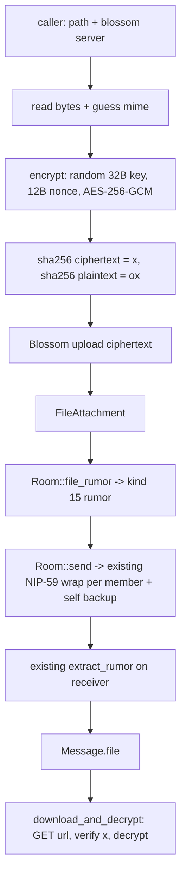

# NIP-17 Encrypted File Messages (kind 15) — Backend Plan

Implementation plan for sending and receiving NIP-17 **file messages** in coop.

**Scope: backend only.** This document covers crypto, blob upload/download, rumor
construction, rumor parsing and local caching. No UI work (composer button, file
rendering, image cache, decryption-on-render state) — that is a separate follow-up
once these APIs exist.

---

## 1. What the protocol requires

NIP-17 file messages are **not** a new transport. They reuse everything coop already
has (NIP-44, NIP-59 seal + gift wrap, kind 10050 inbox relays) and only add:

1. A new inner **rumor kind: `15`** (`Kind::Custom(15)`), whose `.content` is the URL
   of an **encrypted** blob and whose tags carry the MIME type and the decryption
   material.
2. **AES-256-GCM** encryption of the file bytes before upload.

Kind 15 tags (per NIP-17):

| Tag | Required | Meaning |
|---|---|---|
| `p` | yes | receivers (as for kind 14) |
| `e` | if reply | parent message id |
| `subject` | optional | conversation title |
| `file-type` | yes | MIME type of the **plaintext** file |
| `encryption-algorithm` | yes | `aes-gcm` (only supported value) |
| `decryption-key` | yes | key for the recipient |
| `decryption-nonce` | yes | nonce for the recipient |
| `x` | yes | SHA-256 hex of the **encrypted** file |
| `ox` | expected | SHA-256 hex of the file **before** encryption |
| `size` | optional | size of the **encrypted** file in bytes |
| `dim` | optional | `<width>x<height>` in pixels |
| `thumbhash` / `blurhash` | optional | placeholder previews |
| `thumb` | optional | thumbnail URL (same key/nonce) |
| `fallback` | optional | extra file sources (same key/nonce) |

Key material travels **inside** the gift wrap, so the public blob URL is useless
without it. That property falls out of the existing seal/gift-wrap code for free.

`thumbhash`, `blurhash`, `thumb`, `fallback` are out of scope for v1 (all optional).

---

## 2. What already exists in coop (verified against the pinned deps)

| Requirement | Location | Status |
|---|---|---|
| NIP-59 seal + gift wrap | `crates/chat/src/room.rs::send_gift_wrap` (`nip59::GiftWrapBuilder`) | exists |
| Per-recipient publish + self backup | `crates/chat/src/room.rs::send` | exists |
| Inbox relays (kind 10050) | `crates/chat/src/lib.rs::handle_notifications` | exists |
| Rumor unwrap + local cache | `crates/chat/src/lib.rs::{extract_rumor,try_unwrap_with,set_rumor,get_rumor}` | exists |
| Kind 14 rumor construction | `crates/chat/src/room.rs::rumor` | exists |
| Blossom upload | `crates/state/src/blossom.rs::upload` (plaintext, random signing key) | partial |
| **Kind 15 rumor + parse** | — | **to add** |
| **AES-256-GCM encrypt/decrypt** | — | **to add** |
| **Encrypted blob upload/download** | — | **to add** |

Verified facts about the pinned SDK (`rust-nostr@b230cec`, `nostr 0.45.4`) and
`gpui@69af529`:

- rust-nostr has **no** kind-15 helper and **no** AES-GCM/AES-GCM-tag support anywhere
  (`FileMetadata` in NIP-94 is kind 1063, unrelated). `nip17.rs` only covers kind 14
  and 10050.
- `nip59::GiftWrapBuilder::new(receiver, rumor: UnsignedEvent)` accepts **any**
  `UnsignedEvent`, so kind 15 flows through the existing wrap/send path unchanged.
- `Kind` has no named variant for 15; `Kind::Custom(15)` is required, and
  `Kind: Display` prints `as_u16()`, so `rumor.kind.to_string()` yields `"15"`.
- `nostr::nips::nip94::Sha256Hash` is public (`from_byte_array`, `to_hex`, `Display`,
  `from_hex`) even though it lives in the nip94 module — usable for `x`/`ox` hex
  formatting without a new hashing crate.
- `gpui::App::http_client()` returns `Arc<dyn HttpClient>` and
  `gpui_web/src/http_client.rs` implements it, so HTTP download is cross-platform.
  `AsyncApp` exposes `update(|app| ...)`, which is how backend async code reaches it.
- `nostr-blossom` exposes `upload_blob`, `get_blob`, `has_blob`, `list_blobs`,
  `delete_blob`.
- The `k` tag is currently hardcoded to `"14"` in two places
  (`room.rs::send_gift_wrap`, `lib.rs::set_rumor`) and used as a room-list filter
  (`lib.rs::get_rooms_task`, `custom_tag(LOWERCASE_K, "14")`).

---

## 3. Dependencies

Add to `[workspace.dependencies]` in `Cargo.toml`, then reference from the crates below.

```toml
aes-gcm = "0.10"   # NEW - RustCrypto: Aes256Gcm, aead::{Aead, KeyInit, OsRng}
sha2    = "0.10"   # NEW (already in Cargo.lock, cached) - SHA-256 for x / ox
base64  = "0.22"   # NEW as a direct dep (already in the tree transitively)
```

- No new RNG dependency: `aes_gcm::aead::OsRng` (the wasm getrandom backends are
  already configured in `web/Cargo.toml`).
- No new hashing/hex dependency: `sha2` output → `nostr::nips::nip94::Sha256Hash::from_byte_array(...).to_hex()`.
- `aes-gcm` is the only crate that needs a crates.io fetch (`aes 0.8` / `aead 0.5` are
  already in the lock file), so it is a small addition to the build graph.
- Hand-rolling AES-GCM is explicitly **not** an option.

---

## 4. Layering and type ownership

`chat` depends on `state` (see `crates/chat/Cargo.toml`), never the reverse, so the
shared types and tag names must live in `state`.

- `crates/state/src/file.rs` (new) owns:
  - `EncryptedFile`, `FileAttachment`, the tag-name constants, `ALGORITHM = "aes-gcm"`
  - `encrypt` / `decrypt` / `sha256_hex`
  - `FileAttachment::from_tags` / `FileAttachment::tags` (single source of truth for
    tag names, so build and parse can't drift)
  - `upload_encrypted`, `download_and_decrypt`
  - re-exported from `crates/state/src/lib.rs`: `mod file; pub use file::*;`
- `crates/chat` consumes it: `message.rs` (parse into `Message`), `room.rs`
  (build kind-15 rumor), `lib.rs` (cache tag + room list query).
- `crates/chat` should re-export the type for the future UI layer:
  `pub use state::FileAttachment;` in `crates/chat/src/lib.rs`.

---

## 5. Data flow (backend)



---

## 6. Implementation steps

### Step 1 — Dependencies

Add the three lines from section 3 and wire them into `crates/state/Cargo.toml`
(`aes-gcm`, `sha2`, `base64`). Run `cargo check -p state` to confirm the fetch works.

### Step 2 — `crates/state/src/file.rs` (new, ~180 LOC)

```rust
use aes_gcm::aead::{Aead, KeyInit, OsRng};
use aes_gcm::{AeadCore, Aes256Gcm, Key, Nonce};
use nostr::nips::nip94::Sha256Hash;
use sha2::{Digest, Sha256};

pub const ALGORITHM: &str = "aes-gcm";
/// Ciphertext hash tag (NIP-17).
const TAG_SHA256: &str = "x";
const TAG_ORIGINAL_SHA256: &str = "ox";
const TAG_FILE_TYPE: &str = "file-type";
const TAG_ALGORITHM: &str = "encryption-algorithm";
const TAG_KEY: &str = "decryption-key";
const TAG_NONCE: &str = "decryption-nonce";
const TAG_SIZE: &str = "size";
const TAG_DIM: &str = "dim";
const TAG_ALT: &str = "alt";

/// Maximum blob size accepted when downloading (bytes). See edge cases.
pub const MAX_FILE_SIZE: usize = 25 * 1024 * 1024;

/// Result of encrypting a file: ciphertext to upload plus NIP-17 key material.
#[derive(Debug, Clone, PartialEq, Eq)]
pub struct EncryptedFile {
    pub data: Vec<u8>,
    /// base64-encoded 32-byte key
    pub key: String,
    /// base64-encoded 12-byte nonce
    pub nonce: String,
}

/// NIP-17 kind 15 attachment metadata (tags + `.content` URL).
#[derive(Debug, Clone, PartialEq, Eq, PartialOrd, Ord)]
pub struct FileAttachment {
    pub url: Url,
    pub mime: String,
    pub key: String,
    pub nonce: String,
    pub sha256: Option<String>,
    pub original_sha256: Option<String>,
    pub size: Option<u64>,
    pub dim: Option<(u32, u32)>,
    /// Non-standard display name (see "Open decisions" #2).
    pub name: Option<String>,
}

impl FileAttachment {
    /// Build the NIP-17 tags for a kind 15 rumor.
    pub fn tags(&self) -> Vec<Tag>;
    /// Parse a kind 15 rumor's tags. Returns `None` if key material is missing
    /// or `encryption-algorithm` is not `aes-gcm`.
    pub fn from_tags(tags: &Tags) -> Option<Self>;
    pub fn is_image(&self) -> bool;
    pub fn display_name(&self) -> SharedString; // falls back to mime/size
}

/// AES-256-GCM encrypt with a fresh random key and nonce.
pub fn encrypt(data: &[u8]) -> Result<EncryptedFile>;
/// AES-256-GCM decrypt using the values from a kind 15 rumor.
pub fn decrypt(data: &[u8], key: &str, nonce: &str) -> Result<Vec<u8>>;

/// Lowercase hex SHA-256, matching the NIP-94 `x`/`ox` convention.
pub fn sha256_hex(data: &[u8]) -> String;

/// Read a file, encrypt it, upload the ciphertext to Blossom, return the attachment.
#[cfg(not(target_arch = "wasm32"))]
pub async fn upload_encrypted(server: Url, path: PathBuf, cx: &AsyncApp) -> Result<FileAttachment>;

/// Fetch the blob, verify its SHA-256 against `expected_sha256`, then decrypt.
pub async fn download_and_decrypt(
    url: &Url,
    key: &str,
    nonce: &str,
    expected_sha256: Option<&str>,
    cx: &AsyncApp,
) -> Result<Vec<u8>>;
```

Implementation notes, in priority order:

1. **Compute `x` and `ox` locally with `sha256_hex`.** Do **not** derive `x` from
   `BlobDescriptor::sha256` — that field is a `bitcoin_hashes::sha256::Hash` whose
   `Display` byte order could not be confirmed from the vendored sources, and a
   reversed digest would silently break integrity checks in other clients. Use the
   Blossom response only for `blob.url`. (`sha2` → `Sha256Hash::from_byte_array(...).to_hex()`
   gives the conventional digest order and is unambiguous.)
2. **Key/nonce decoding must be tolerant.** NIP-17 does not specify an encoding:
   accept base64 standard (padded and unpadded), base64url, and hex on read; emit
   base64 standard on write. See "Open decisions" #1.
3. Validate sizes after decoding: key must be exactly 32 bytes, nonce exactly 12.
   Return a descriptive error otherwise.
4. `decrypt` must fail closed on a bad tag (GCM authentication failure) — never
   return partial plaintext.
5. `upload_encrypted` mirrors the existing `state::blossom::upload` shape:
   `smol::fs::read` + `mime_guess::from_path`, `BlossomClient::new(server)`,
   `upload_blob(ciphertext, Some("application/octet-stream"), None, Some(&keys))`
   wrapped in `Tokio::spawn(cx, ...)`. Note the content type describes the
   **ciphertext**; the plaintext MIME goes in the `file-type` tag.
   On `wasm32` return `Err(anyhow!("File upload not supported on web"))`, matching
   the existing stub in `blossom.rs`.
6. `download_and_decrypt` uses gpui's HTTP client
   (`cx.update(|app| app.http_client())`, then
   `client.get(url.as_str(), AsyncBody::default(), true)`), reads the body with
   `futures::AsyncReadExt`, caps the read at `MAX_FILE_SIZE + 1` and rejects anything
   larger, verifies `sha256_hex(&ciphertext)` against `expected_sha256`
   (case-insensitive) when present, then decrypts. This path works on desktop and web.
7. `size` in `FileAttachment` is the **ciphertext** size (per the NIP wording), i.e.
   `encrypted.data.len()`. `dim` is optional; if wanted, decode dimensions with the
   `image` crate (`image::ImageReader`) — mark as a nice-to-have, not a blocker.
8. `encrypt` should take `&[u8]` (not a path) so it stays pure and testable without I/O.

### Step 3 — `crates/chat/src/message.rs` (~80 LOC)

- Add the kind constant next to `Message`:

  ```rust
  /// NIP-17 file message (rust-nostr has no named `Kind` variant for 15).
  pub const KIND_FILE_MESSAGE: Kind = Kind::Custom(15);
  ```

- Add the field:

  ```rust
  pub struct Message {
      // ... existing fields ...
      /// Encrypted file attachment (NIP-17 kind 15)
      pub file: Option<FileAttachment>,
  }
  ```

- In all three `From` impls (`&Event`, `&UnsignedEvent`, `&NewMessage`), parse from
  tags when `kind == KIND_FILE_MESSAGE`, and when a file is present **do not** run
  `extract_and_remove_media_urls` or `extract_mentions` on `.content` — for kind 15
  `.content` is a ciphertext URL that must never be rendered as text or as media:

  ```rust
  let file = (val.kind == KIND_FILE_MESSAGE)
      .then(|| FileAttachment::from_tags(&val.tags))
      .flatten();

  let (media, content) = if file.is_some() {
      (vec![], String::new())
  } else {
      extract_and_remove_media_urls(&val.content)
  };
  ```

- Add a helper for non-UI consumers that display a message one-line
  (reply previews, notifications, copy):

  ```rust
  /// Single-line representation: text for kind 14, `[File] <name>` for kind 15.
  pub fn preview(&self) -> SharedString;
  ```

- `Ord`/`Eq`/`Hash` are keyed on `id`/`created_at`, so adding the field does not
  change `Message` ordering semantics.

### Step 4 — `crates/chat/src/room.rs` (~70 LOC)

- Extract the shared tag logic from `rumor()` into a private helper so kind 14 and
  kind 15 cannot drift:

  ```rust
  /// `subject` + reply `e` tags + receiver `p` tags (excluding `sender`).
  fn conversation_tags(&self, replies: &[EventId], sender: PublicKey, cx: &App) -> Vec<Tag>;
  ```

  `rumor()` then becomes `EventBuilder::new(kind, content).tags(self.conversation_tags(...))`,
  and gains no behavior change.

- Add:

  ```rust
  /// Build a NIP-17 kind 15 (file message) rumor.
  ///
  /// WARNING: never sign and send this event to relays; it is only ever wrapped.
  pub fn file_rumor<I>(&self, file: FileAttachment, replies: I, cx: &App) -> Option<UnsignedEvent>
  where
      I: IntoIterator<Item = EventId>,
  {
      // tags = conversation_tags(...) ++ file.tags()
      // content = file.url.to_string()
      // EventBuilder::new(KIND_FILE_MESSAGE, content).tags(tags).finalize_unsigned(sender)
      // then event.ensure_id()
  }
  ```

- Fix the gift wrap's `k` tag so relays see the real inner kind
  (`send_gift_wrap`, currently hardcoded):

  ```rust
  let k_tag = Tag::custom("k", [rumor.kind.to_string()]);
  ```

- `Room::send` needs **no change**: it already accepts any `UnsignedEvent`, and the
  self-backup branch publishes the same rumor wrapped for the sender, so the sender's
  other devices receive the file message with the same key material.

### Step 5 — `crates/chat/src/lib.rs` (~5 LOC)

- `set_rumor`: store the real kind in the local cache tag:

  ```rust
  Tag::custom("k", [rumor.kind.to_string()]),
  ```

- `get_rooms_task` currently filters `custom_tag(SingleLetterTag::LOWERCASE_K, "14")`,
  which would hide rooms whose only messages are file messages. Simplest fix: drop
  the `k` filter and keep `.kind(Kind::ApplicationSpecificData)`; the existing
  in-loop JSON parse plus `tags.public_keys().next().is_some()` check already
  discards junk, and kind 30078 rows in the local DB exist only for this rumor cache.
  Fallback if the extra rows are a concern: run two queries (`k = "14"` and
  `k = "15"`) and merge the results.

- No changes to `handle_notifications`, `extract_rumor`, `try_unwrap_with`, `new_message`,
  `Room::get_messages` — all are already kind-agnostic. (`Room::get_messages` filters
  only on the `r` room tag, so file messages load with the rest of the history.)

### Step 6 — (out of scope) UI wiring

Composer entry point, decryption cache, image/file rendering live in
`crates/chat_ui`. Not part of this plan; the APIs above are what that layer needs:
`state::upload_encrypted`, `FileAttachment::tags/from_tags`, `Room::file_rumor`,
`Room::send`, `state::download_and_decrypt`.

---

## 7. Open decisions

1. **Key/nonce encoding (interop risk — decide/verify first).** NIP-17 does not specify
   how `decryption-key` / `decryption-nonce` are encoded, and no reference
   implementation could be reached from this environment to confirm. Plan: emit
   **base64 standard**, accept base64 std/unpadded/url-safe/hex on read. Before
   release, verify against another NIP-17 client (0xchat, Amethyst) and tighten if
   needed. Everything else in the plan is encoding-agnostic.
2. **Display name.** The NIP defines no filename tag and Blossom URLs end in a content
   hash, so a name has to come from a non-standard tag. Proposal: emit
   `["alt", <file name>]` (NIP-94 tag; NIP-17 allows "rest of tags", and `alt` is a
   benign a11y field), tolerate its absence, fall back to mime + size. Alternative:
   ship strictly spec-shaped and show mime + size only.
3. **`thumbhash`/`blurhash`/`thumb`/`fallback`/`dim`**: all optional; recommend skipping
   in v1 (and letting the UI show a placeholder until the blob is decrypted).
4. **Web (wasm)**: encrypted upload stays unsupported on web, matching today's
   `state::blossom::upload` stub. Download/decrypt is cross-platform via gpui's client.
5. **Ciphertext caching**: recommend *not* persisting decrypted plaintext in the local
   database in v1; decryption happens on demand from the blob URL.

---

## 8. Edge cases and failure handling

| Case | Behavior |
|---|---|
| `encryption-algorithm` != `aes-gcm` | do not decrypt; report "unsupported encryption" (forward compatibility) |
| missing `decryption-key` / `decryption-nonce` | `FileAttachment::from_tags` returns `None` → surfaced as a failed message, not a panic |
| key != 32 bytes or nonce != 12 bytes | descriptive error |
| GCM authentication failure | error; never emit partial plaintext |
| `sha256_hex(ciphertext) != x` | error (tampered or corrupted blob), checked **before** decrypting |
| blob larger than `MAX_FILE_SIZE` | rejected while reading the body |
| HTTP error / non-200 | error message including status |
| `content` not a valid URL | error; message still cached so it renders as a failed attachment |
| sender's own copy | works automatically via the existing self-backup gift wrap |
| multiple receivers | one blob, one key, key re-sent inside each recipient's gift wrap |

---

## 9. Verification

The feature cannot be exercised end-to-end without the UI step (out of scope), so
backend verification is:

1. `cargo check -p state -p chat` after each step.
2. `cargo check -p coop_web --target wasm32-unknown-unknown` to confirm the
   `cfg(target_arch = "wasm32")` stubs and the new module compile for web.
3. Cheap unit checks (no network, ~15 LOC in `state/src/file.rs`), despite "no tests
   required" for the feature, because these are pure functions and catch the two
   riskiest bugs — encoding and tag ordering:
   - `encrypt` → `decrypt` round trip returns the original bytes.
   - flipping one ciphertext bit makes `decrypt` fail.
   - `sha256_hex(b"abc") == "ba7816bf8f01cfea414140de5dae2223b00361a396177a9cb410ff61f20015ad"`
     (confirms the digest order used for `x`/`ox`).
   - `FileAttachment` tags → `from_tags` round trip preserves key/nonce/mime/url.
4. End-to-end (requires the UI step or a temporary call site): send to self with
   `RoomConfig::backup` enabled and confirm the rumor unwraps, downloads, verifies and
   decrypts; then a second account; then a cross-client check for decision #1.

---

## 10. Estimated size

| File | Change | ~LOC |
|---|---|---|
| `Cargo.toml`, `crates/state/Cargo.toml` | deps | 6 |
| `crates/state/src/file.rs` | new | 180 |
| `crates/state/src/lib.rs` | module + re-export | 2 |
| `crates/chat/src/message.rs` | parse + preview | 80 |
| `crates/chat/src/room.rs` | `file_rumor` + tag refactor + `k` tag | 70 |
| `crates/chat/src/lib.rs` | cache tag + room list query | 5 |

Order of work: 1 → 2 → 3 → 4 → 5, each step compiling on its own. Steps 2–4 are
independent of any UI change, so the branch stays green without touching `chat_ui`.
